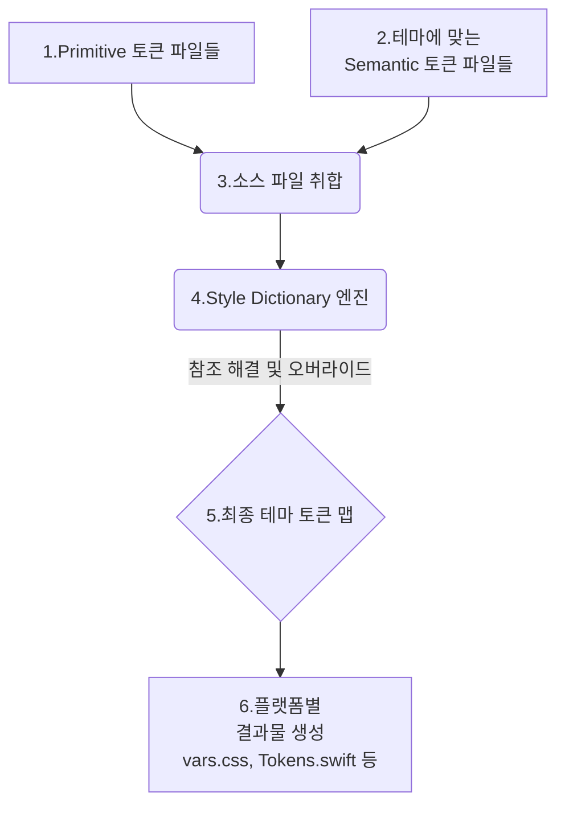
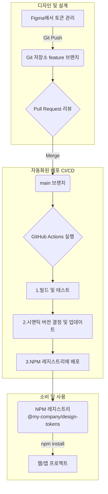

# UDS 토큰: 설계 및 사용 가이드

이 저장소는 UDS(Unified Design System)의 디자인 토큰을 관리, 빌드, 배포하기 위한 중앙 허브입니다. [Tokens Studio](https://tokens.studio/)를 사용하여 Figma에서 토큰을 관리하고, [Style Dictionary](https://amzn.github.io/style-dictionary/)를 통해 여러 플랫폼(Web, iOS, Android)에서 사용할 수 있는 결과물을 생성합니다.

## 1. 토큰 아키텍처

본 시스템의 토큰은 확장성과 유지보수성을 극대화하기 위해 두 가지 핵심 계층으로 분리됩니다.

### 계층 1: Primitive Tokens (원시 토큰)

-   **역할**: 디자인 시스템의 가장 기본적인 "원재료"입니다.
-   **특징**: 문맥에 구애받지 않는 순수한 값입니다. (예: `#FFFFFF`, `16px`)
-   **파일 위치**: `tokens/primitive/*.json`

### 계층 2: Semantic Tokens (의미 토큰)

-   **역할**: 원시 토큰을 참조하여 "어디에, 왜 쓰이는지"에 대한 의미를 부여합니다.
-   **특징**: 실제 애플리케이션의 UI를 구성하는 데 사용됩니다. (예: `color-background-primary`는 `color-primitive-gray-50`을 참조)
-   **파일 위치**: `tokens/semantic/**/*.json`

### 테마 (Themes)

**테마**는 특정 **의미 토큰들의 조합**으로 정의됩니다. 예를 들어, `dark-easy-condensed` 테마는 다음 세 가지 의미 토큰 세트의 조합입니다.

-   **Color**: `dark.json`
-   **Typography**: `easy.json` (큰 글씨 모드)
-   **Dimension**: `condensed.json` (좁은 간격 모드)

이 구조를 통해 다양한 테마를 유연하게 생성하고 확장할 수 있습니다.

```
tokens/
├───$themes.json              # 빌드할 테마 조합 정의
├───primitive/                # 원시 토큰 (원재료)
│   ├───color.json
│   ├───size.json
│   └───typography.json
└───semantic/                 # 의미 토큰 (테마별 레시피)
    ├───color/
    │   ├───light.json
    │   └───dark.json
    ├───typography/
    │   ├───default.json
    │   └───easy.json
    └───dimension/
        ├───default.json
        └───condensed.json
```

## 2. 빌드 프로세스: 테마 생성 원리

`npm run build` 실행 시, `scripts/build-tokens.mjs` 스크립트가 다음 로직에 따라 토큰을 변환합니다.

1.  **테마 정의 로드**: `tokens/$themes.json` 파일을 읽어 빌드할 모든 테마 조합 목록을 가져옵니다.
2.  **테마별 순회**: 각 테마(`light-default-default` 등)에 대해 다음을 반복합니다.
    a. **소스 파일 취합**: 모든 `primitive` 토큰 파일과 해당 테마에 정의된 `semantic` 토큰 파일들을 하나의 목록으로 합칩니다.
    b. **Style Dictionary 실행**: 취합된 소스 파일 목록을 Style Dictionary에 전달합니다.
    c. **참조 해결 및 오버라이드**: Style Dictionary는 `{color.primitive.blue.500}` 같은 참조를 실제 값(`#2196f3`)으로 변환합니다. 만약 semantic 토큰과 primitive 토큰의 이름이 같다면, **semantic 토큰이 우선**되어 값이 덮어씌워집니다. 이것이 테마가 작동하는 핵심 원리입니다.
    d. **플랫폼별 파일 생성**: 최종 결정된 토큰 맵을 기반으로 각 플랫폼(CSS, SCSS, JS, Swift, XML)에 맞는 포맷의 파일을 생성하여 `tokens/build/{테마이름}/` 경로에 저장합니다.



## 3. 배포 및 버전 관리 전략

토큰은 **NPM 패키지**로 배포하여 안정성과 버전 관리를 보장합니다. 모든 과정은 CI/CD를 통해 자동화됩니다.

### 자동화된 배포 워크플로우

1.  **토큰 수정**: 디자이너가 Figma에서 토큰을 수정하고, Tokens Studio의 동기화 기능을 통해 Git 저장소의 새로운 브랜치로 변경사항을 Push합니다.
2.  **Pull Request (PR) 생성**: `main` 브랜치로의 PR을 생성하여 변경사항을 리뷰합니다.
3.  **`main` 브랜치에 병합**: PR이 승인되고 `main`에 병합되면, CI/CD 파이프라인이 자동으로 실행됩니다.
4.  **CI/CD 파이프라인 (GitHub Actions)**:
    a. **빌드**: `npm run build`를 실행하여 모든 테마의 결과물을 생성합니다.
    b. **버전 결정**: 커밋 메시지를 분석하여 `patch`, `minor`, `major` 버전을 자동으로 결정하고 `package.json` 버전을 업데이트합니다.
    c. **NPM 배포**: `npm publish`를 실행하여 새로운 버전의 패키지를 NPM 레지스트리에 배포합니다.
    d. **Git 태깅 및 릴리즈 노트**: 해당 버전에 대한 Git 태그를 생성하고, 변경사항을 담은 릴리즈 노트를 자동으로 생성합니다.



## 4. 개발자를 위한 사용 가이드

### 가. 설치

```bash
npm install @my-company/design-tokens
```

### 나. 사용 예시

패키지 내의 `dist` 폴더(또는 `tokens/build`)에 빌드된 결과물이 포함되어 있습니다.

**CSS/SCSS에서 사용**

```css
/* global.css 또는 App.scss */

/* 라이트-기본-기본 테마 사용 */
@import "@my-company/design-tokens/dist/light-default-default/vars.css";

body {
  background-color: var(--color-background-primary);
  font-family: var(--typography-body-font-family);
}
```

**JavaScript (React, Vue 등)에서 사용**

```javascript
import tokens from '@my-company/design-tokens/dist/dark-default-default/tokens.js';
import styled from 'styled-components';

const ThemedButton = styled.button`
  background-color: ${tokens.color.background.primary.value};
  font-size: ${tokens.typography.body.fontSize.value};
  padding: ${tokens.dimension.spacing.inset.value};
  border-radius: ${tokens.dimension.border.radius.value};
`;
```

**네이티브(iOS/Android)에서 사용**

-   `node_modules/@my-company/design-tokens/dist/{테마명}/` 경로에서 `Tokens.swift`, `colors.xml`, `dimens.xml` 등의 파일을 프로젝트에 직접 추가하거나, 빌드 스크립트를 통해 자동으로 복사하여 사용합니다.

## 5. 주요 스크립트

-   `npm run build`: `tokens/$themes.json`에 정의된 모든 테마를 빌드합니다.
-   `npm run pull-figma`: (수동) Figma API를 통해 토큰 정보를 가져옵니다. Tokens Studio 동기화 기능을 사용할 경우 보조적인 역할만 합니다.
